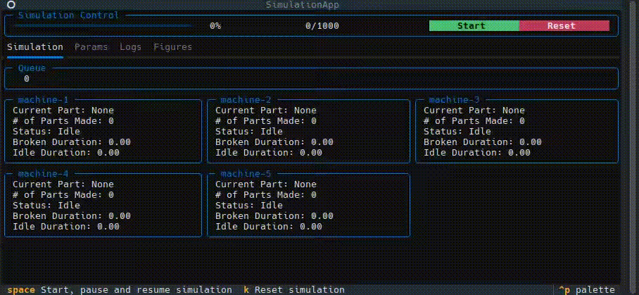

# Demo Simpy Textual



Example demonstrating how to use textual to visualize simpy discrete event simulations.


**Running in dev with auto reload:**
```
ptw . --runner "textual" run --dev "simulation_app.py"
```

**Packaging app to Linux executable :**
```
pyinstaller --onefile -w "simulation_app.py" --add-data="simulation_app.tcss:."
```

**Packaging app to Windows executable :**
```
pyinstaller --onefile -c "simulation_app.py" --add-data="simulation_app.tcss;."
```